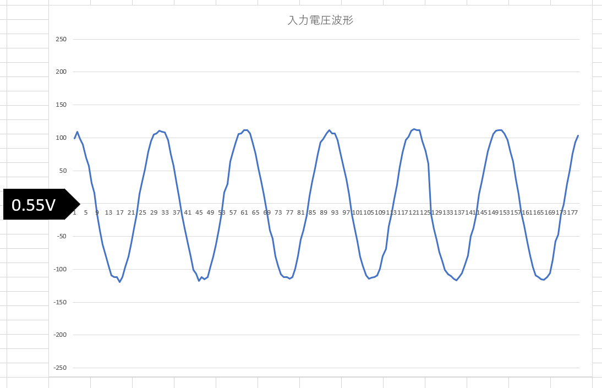
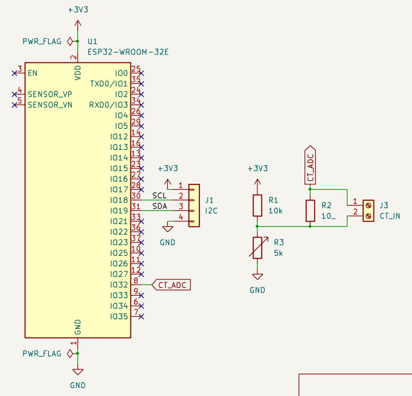

# ESP32CurrentSensor
注意：現時点では、まだ通信のセキュリティ対策を実装していません。

## 概要
このコードは個人で開発を行っている「電気使い過ぎ防止システム」の電流センサー部分で使用するものです。
ESP32で分電盤やコンセントから供給される交流電流を測定し、電流値をディスプレイに表示することができます。
また、ネットワークに接続し、外部のソフトに測定データを送信することができます。

### 電気使い過ぎ防止システムとは？
「電気使い過ぎ防止システム」は、電気の使い過ぎにより家庭や施設のブレーカーが落ちることを未然に防ぐための仕組みです。
学校で授業を受けている際、ブレーカーが落ちて授業が止まってしまうことが多いことがきっかけで開発に着手しました。

### 電気使い過ぎ防止システムの機能
使い過ぎを防止したい箇所の電気配線に専用のセンサー機器を設置し電流を定期的に測定します。
そして、電流の測定値が基準値を上回った際に、PCで利用できる確認通知ソフトから電気の使い過ぎを警告します。
警告は画面や音によるもので、施設利用者に対し電気使用量削減を促します。

## 機能

* 交流電流測定機能：分電盤やコンセントから供給される交流電流を、ESP32に接続した変流器(CT)を用いて測定することができます。
* ディスプレイ表示機能：キャラクタディスプレイ（I2C接続）を接続すると、測定結果が画面に表示されます。（ディスプレイの使用は任意）
* 測定データ送信機能：Wi-Fiで本体をネットワークに接続し、測定結果を外部の確認通知ソフトに送信することができます。

## 動作環境
* 動作ハードウェア:ESP32
    * MicroPythonのファームウェアがインストール済であること
    * CTによる測定回路を接続していること（詳しくは[使い方](#使い方)を参照）
* 対応ディスプレイ:AQM1602XA-RN-GBW(I2C接続)

## 使い方

### センサーからの入力方法

[測定回路](#測定回路)の例を参考に、CTの2次側に精度の高い測定用抵抗を取り付けます。この測定用抵抗の両端の電圧に+0.55Vを加えたものをGPIO32に入力してください。

なお、プログラムでは測定条件の規定値が設定されており、これ以外の条件で測定を行う場合はプログラムを修正する必要があります。

> 規定値:測定抵抗…10Ω　CTの変流比…3000:1

修正方法は、main.pyを開き、

```
current = measureRMSCurrent(adc32, ratio, resistance)
# 21行目
```
上記の`ratio`の部分に変流比[ratio:1]を、`resistance`の部分に測定用抵抗[Ω]の値を、それぞれ入力します。

### 接続設定
接続設定はファイル"config.json"を作成し、ESP32内に書き込みます。
`<PC_IP_ADDRESS>`には、確認通知ソフトを起動するPCのIPアドレスを入れます。なお、PC側のIPアドレスはあらかじめ固定しておくことを推奨します。
```
{
    "wifi_ssid": "<SSID>",
    "wifi_pass": "<PASSWORD>",
    "ip_addr": "<PC_IP_ADDRESS>"
}
```
接続設定については、今後シリアル通信や、確認通知ソフト上での設定ができるよう改善予定です。

### 測定手順

1. [接続設定](#接続設定)を行い、接続情報の登録をします。 必要であれば、接続先PCのIPアドレス固定も行ってください。
2. 先に確認通知ソフト（PC側）を起動して、測定待機状態にしておきます。
3. センサーを取り付けたESP32の電源を入れます。
4. Wi-Fiに接続後、電流データの送信が始まります。

## 測定回路
### 回路図

I2C端子はディスプレイの、CT_IN端子はCTの接続部分です。R3の規定値は2kΩです。微調整のため、可変抵抗となっています。
